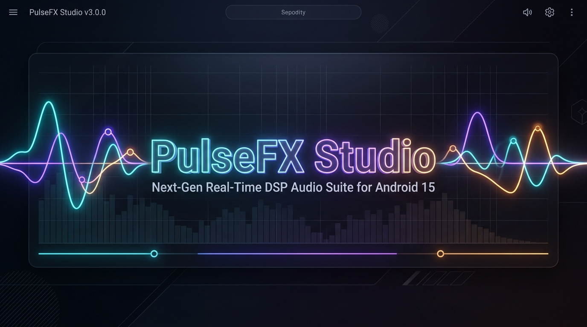

<p align="center">
  
</p>

# 🎛️ PulseFX Studio (v1.3.2)

<p align="center">
  
</p>

<p align="center">
  <strong>Next-Generation Real-Time DSP Audio Mastering Suite for Android 15 & Modern Devices</strong><br>
  <em>Engineered for Non-Root (Shizuku / Shevery) & Rooted Audiophiles with Zero-Permission Native Audio Hooking.</em>
</p>

<p align="center">
  <a href="https://github.com/Densuper/PulseFX-Studio-Suite/releases/tag/v1.3.2"></a>
  <a href="https://developer.android.com"></a>
  
  
  <a href="LICENSE"></a>
</p>

---

## 🚀 Overview

**PulseFX Studio** is a complete, ground-up reimagining of Android audio signal processing. While inspired by the legendary acoustic concepts of **ViPER's Audio**, PulseFX Studio eliminates legacy C++ kernel driver dependencies in favor of a high-precision **32-bit floating-point DSP engine** that works across **all media (YouTube, Spotify, Apple Music, Games, Web Audio)** without requiring screen capture or intrusive permissions.

Featuring an interactive **Catmull-Rom Paragraphic Spline Curve Equalizer**, dynamic resonance visualizers, externalized dB & Hz graph axes, and a **100% Google Material 3 Dynamic Theme** (adapting automatically to phone wallpaper palettes in light and dark modes), PulseFX Studio brings studio-grade mastering to modern Android.

---

## 🌟 Key Features

### 🎧 1. Connected Earphones & Sources Header
- **Top Source Route Card**: Identifies active audio output (e.g. CMF Buds, USB-C DAC, or Stereo Speakers) in straight alignment matching the theme.

### ⚡ 2. Symmetrical Straight Glowing Line Traces
- **Dynamic Activation Glow**: Straight vertical energy connector lines positioned on both the left and right sides of each module that light up in theme colors whenever an effect is enabled.

### 🎛️ 3. Interactive Paragraphic Spline Curve Equalizer & Live FFT Motion
- **Dual-Mode Visualizer**: When EQ is OFF, the 10 frequency nodes & spline curve glide organically with slow, natural movement tracking real audio output. When EQ is ON, it renders the user's touch-interactive target curve.
- **20 Hz to 20 kHz Logarithmic Scale**: Freeform touch drawing and individual node dragging with smooth Catmull-Rom cubic spline interpolation.
- **Externalized Axis Architecture**: dB scales and frequency markers are rendered cleanly outside the curve box for unobstructed visualization.
- **One-Touch Reset**: Instantly flatten the response curve to 0 dB.
- **21 Classic Audiophile Presets**: Acoustic, Bass Booster, Classical, Dance, Deep, Electronic, Hip-Hop, Jazz, Rock, Vocal Booster, etc.

### 🔊 4. Real-Time Acoustic Mastering Modules (18-Module Suite)
1. **Master Limiter**: Lookahead soft-knee true-peak ceiling (0 dBFS protection) with independent output gain and pan control.
2. **Playback AGC**: Fast-attack ballistic automatic gain leveling with configurable multipliers up to 18x.
3. **FET Compressor**: Dynamic transfer curve visualizer with adjustable threshold (-40 to 0 dB), ratio (1:1 to 20:1), and makeup gain.
4. **ViPER-DDC (Digital Device Correction)**: Harman and acoustic correction curves for Apple AirPods Pro, Sony WH-1000XM4, Sennheiser HD650, Audio-Technica M50x, Beyerdynamic DT990, Bose QC45, Galaxy Buds2 Pro, etc.
5. **Spectrum Extension (VSE)**: High-frequency cubic harmonic re-synthesis ($hf^3$) restoring lossy audio detail.
6. **FIR Equalizer**: 10-Band ISO peaking biquad filters with interactive touch nodes.
7. **Convolver / Analog Tape & Console Modeling**: Studer A800 tape machine, Telefunken 12AX7 tube, Sony Walkman MegaBass, Lexicon 480L hall reverb, Dolby Atmos air, Neve 1073 console transformer, and SSL 4000G bus compressor.
8. **Field Surround**: Mid-Side vocal and soundstage spatializer with 3D Virtualizer integration.
9. **Differential Surround**: Haas psychoacoustic inter-aural time delay ($1\text{ ms} \to 20\text{ ms}$) via a 2400-sample circular ring buffer.
10. **Headphone Surround+ (VHE)**: Binaural HRTF crossfeed eliminating in-head listening fatigue.
11. **Schroeder-Moorer Reverberation**: 4 parallel feedback comb filters with high-frequency damping + all-pass diffusion matrix.
12. **Dynamic System**: Device-specific impedance modeling and dynamic low-frequency sub-bass punch.
13. **Analog Tube Simulator (6N1P / 12AX7)**: Non-linear hyperbolic tangent ($\tanh$) dual-triode saturation for warm 2nd-order harmonics.
14. **ViPER Bass**: Dynamic sub-harmonic frequency synthesizers with **Natural Bass**, **Pure Bass+ (Quadratic Rectification)**, and **Subwoofer** modes (up to +18dB).
15. **ViPER Clarity**: High-shelf harmonic overtones with **Natural**, **Ozone+ (Asymmetric Exciter)**, and **XHiFi Pro** harmonic expansion (up to +14dB).
16. **Auditory System Protection (Cure+ Crossfeed)**: Transient softening and anti-sibilance filter for extended listening.
17. **AnalogX**: Class-A discrete transformer harmonic injection across low and high registers.
18. **Speaker Optimization**: Acoustic correction profile boosting clean SPL on external phone speakers.

---

## 🛡️ Architecture: Non-Root (Shizuku / Shevery) vs. Standalone

```
┌─────────────────────────────────────────────────────────────┐
│                 ALL AUDIO SOURCES                           │
│     YouTube • Spotify • Apple Music • Games • Chrome        │
└──────────────────────────────┬──────────────────────────────┘
                               │
            ┌──────────────────┴──────────────────┐
            ▼                                     ▼
┌──────────────────────────────┐    ┌──────────────────────────────┐
│  NON-ROOT (Shizuku/Shevery)  │    │       STANDALONE MODE        │
│   Shevery AudioFlinger Hook  │    │   Native Android AudioEffect │
│   Hardware Offload Disabled  │    │   Direct Media App Sessions  │
└──────────────┬───────────────┘    └──────────────┬───────────────┘
               │                                   │
               └──────────────────┬────────────────┘
                                  ▼
┌─────────────────────────────────────────────────────────────┐
│           PULSEFX 32-BIT FLOAT DSP ENGINE (Pure Math)       │
│    Biquads • Splines • Tube Saturation • Soft Limiter       │
└──────────────────────────────┬──────────────────────────────┘
                               ▼
┌─────────────────────────────────────────────────────────────┐
│                 PHYSICAL HARDWARE OUTPUT                    │
│     DAC / USB-C / CMF Buds (Bluetooth) / Phone Speakers     │
└─────────────────────────────────────────────────────────────┘
```

---

## 📥 Installation

### 🟢 Method 1: Non-Root Shizuku / Shevery Setup *(Recommended for 100% System-Wide Sound)*
1. Download **`PulseFX-Studio-v1.3.2.apk`** and **`PulseFX-Studio-v1.3.2-Shevery.zip`** (1.99 KB) from [Releases](https://github.com/Densuper/PulseFX-Studio-Suite/releases).
2. Install **`PulseFX-Studio-v1.3.2.apk`** on your phone.
3. Open **Shevery** (with Shizuku active) $\to$ Tap **Add Module (+)** $\to$ Select **`PulseFX-Studio-v1.3.2-Shevery.zip`** $\to$ Tap **Install**.
4. Open **PulseFX Studio** and toggle **Master Power**. All audio across YouTube, games, browsers, and media players is now mastered in real time!

### 🔵 Method 2: Standalone Plug & Play Mode *(Zero Setup / APK Only)*
1. Download and install **`PulseFX-Studio-v1.3.2.apk`**.
2. In **Spotify** or **Apple Music**, go to Settings $\to$ Equalizer $\to$ Select **PulseFX Studio**.

### 🛡️ Method 3: Magisk / KernelSU / APatch *(For Rooted Audiophiles)*
1. Flash **`PulseFX-Studio-v1.3.2-Shevery.zip`** in Magisk / KernelSU.
2. Reboot your device and open **PulseFX Studio**.

---

## 👥 Authors & PulseFX Core Team

| Name | Role | Responsibilities |
| :--- | :--- | :--- |
| **[Denver Colaco](https://github.com/Densuper)** | **Lead Architect & Creator** | Project vision, sovereign direction, system-wide audio interception concept, and master engineering. |
| **J.A.R.V.I.S.** | **Lead Architect & Systems Integrity** | Zero-regression validation, architectural impact assessments, release orchestration, and subagent governance. |
| **VECTOR** | **UI/UX & Motion Specialist** | Jetpack Compose architecture, dynamic Material 3 design, titanium dial adaptive iconography, externalized graph axes, and tactile haptic curves. |
| **CIPHER** | **DSP Audio Engine & Systems Specialist** | 32-bit floating-point mathematical DSP filters, Catmull-Rom splines, Convolver tape/tube models, AudioFlinger session hook, and Shizuku/Shevery integration. |

---

## 🌟 Tributes & Heritage
* **ViPER's Audio (Euphony & ZhuHang)** — For pioneering a decade of Android audiophile passion and classic acoustic concepts.
* **The Shizuku & Shevery Teams** — For empowering the Android community with non-root system API capabilities.
* **Team DeWitt & Iscle** — For their open-source Android audio explorations.

---

## 📄 License
This project is open-source under the [Apache License 2.0](LICENSE).
